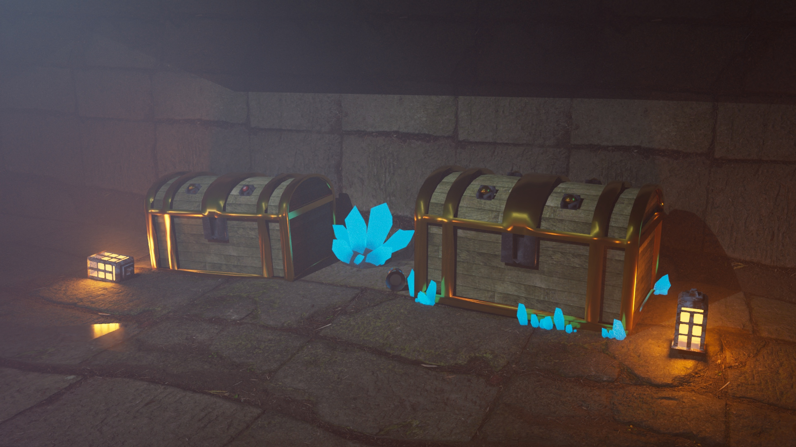
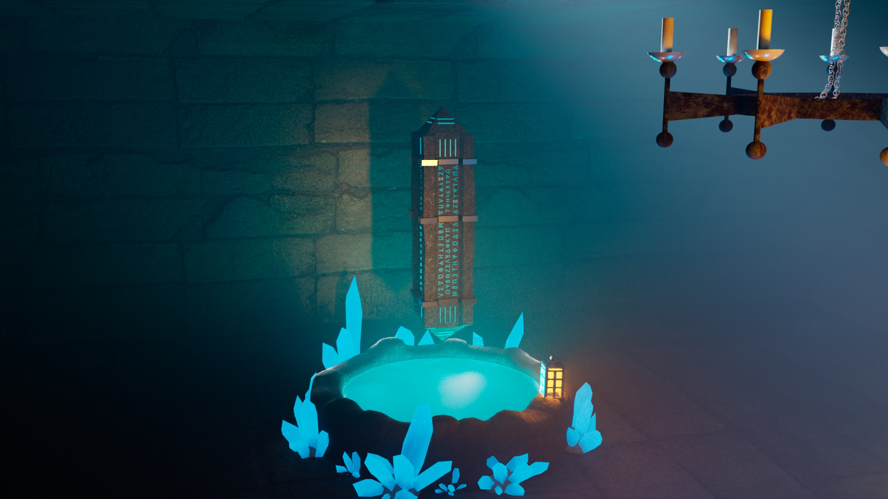
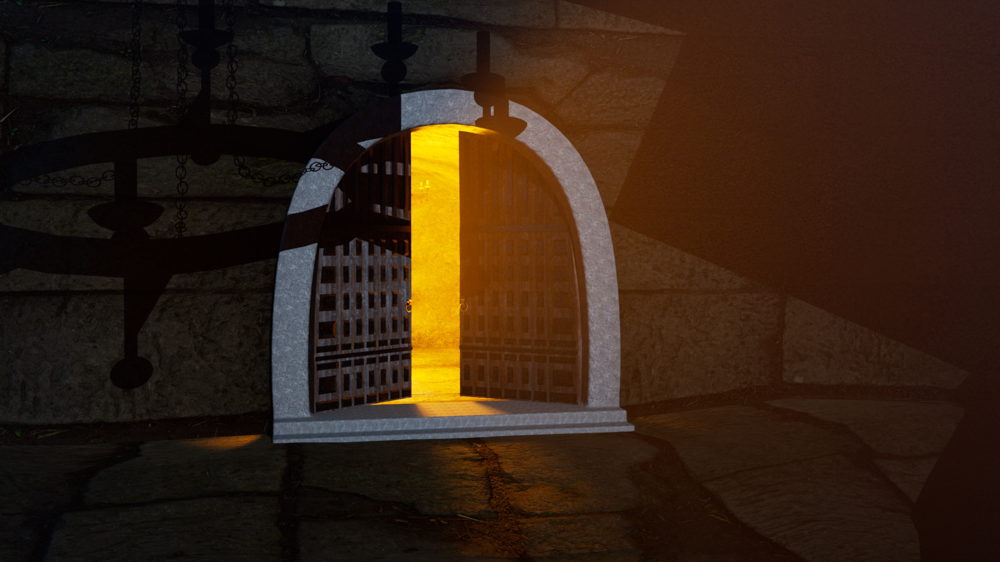
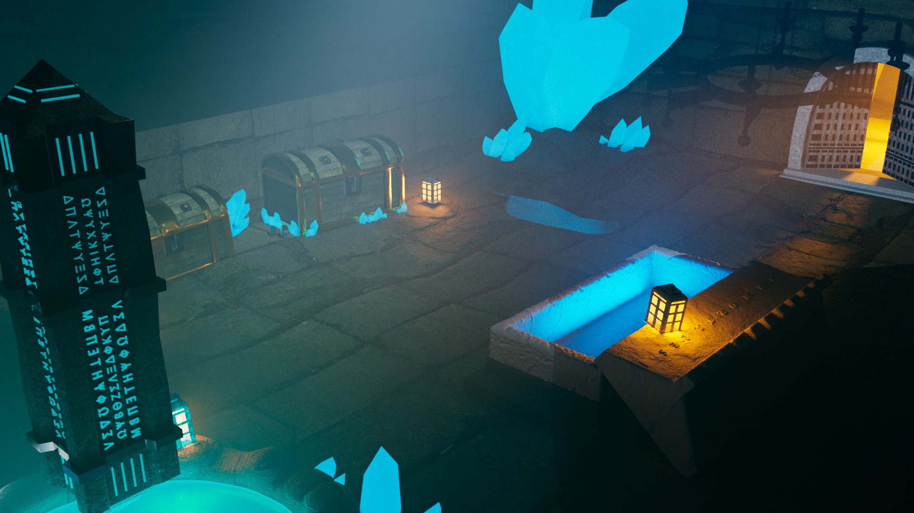
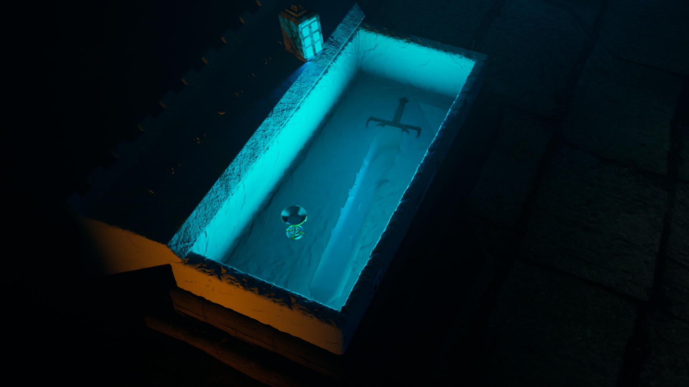

## project name

projected description

porject images

{: .image1 .images}

 
{: .image2 .images}

 
{: .images}

{: .images}

{: .images}

{: .images}

some blabla (?)

project videos

app used

<a href="pages_pour_projets/pluie_tunnel.html" class="btn">Projet : Pluie Sous-Marine &#x2192;</a>

<a href="pages_pour_projets/vous_etes_le_heros.html" class="btn">Projet : Vous Êtes Le Héros : Monster Hunter &#x2192;</a>

<a href="pages_pour_projets/Tombeau.html" class="btn">Projet : Tombeau &#x2192;</a>

<a href="index.html" class="btn"> &#x2190; Accueil</a>