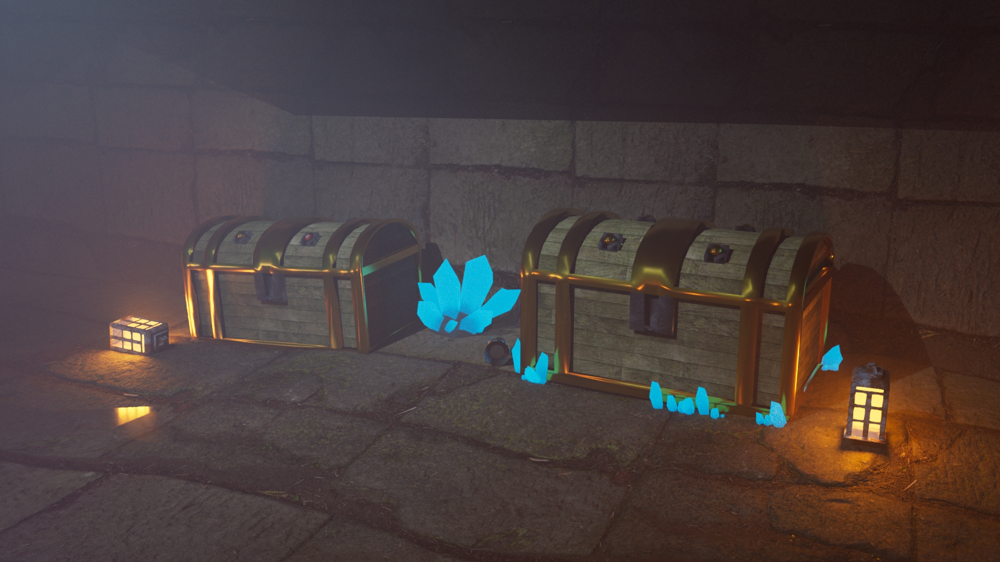

## project name

projected description

porject images

{: .images}

{: .images}

{: .images}

{: .images}

{: .images}

some blabla (?)

project videos

app used

<a href="Page_Projets.html" class="btn"> &#x2190; Retour</a>